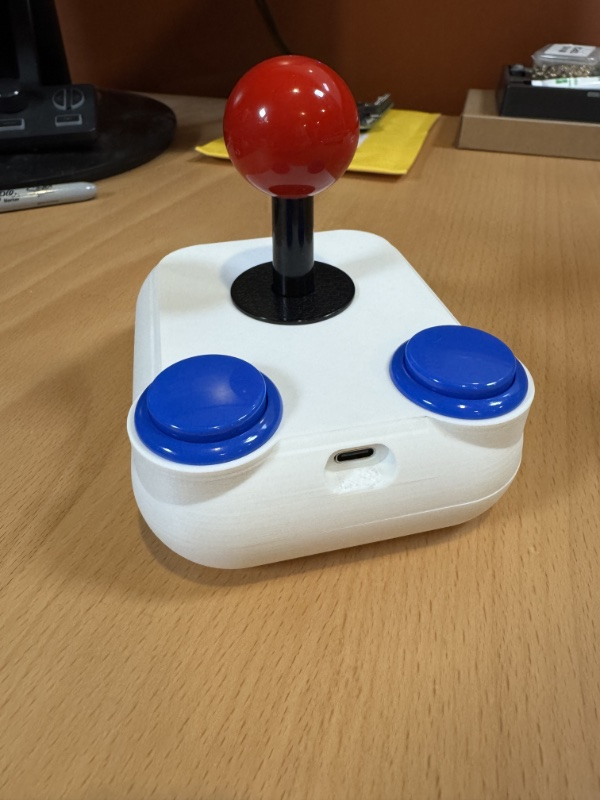
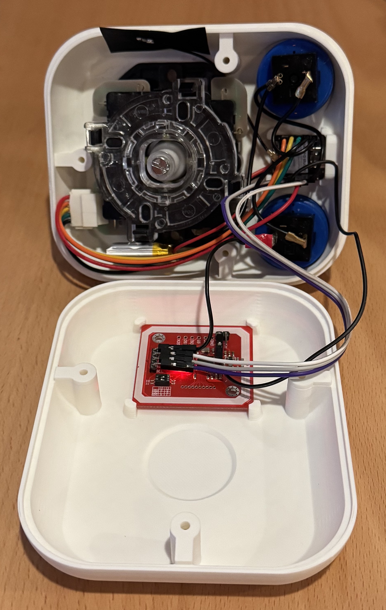
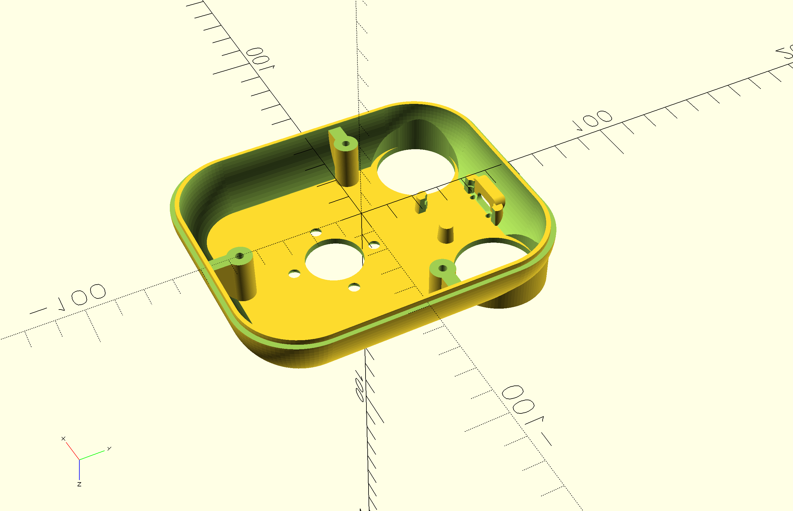
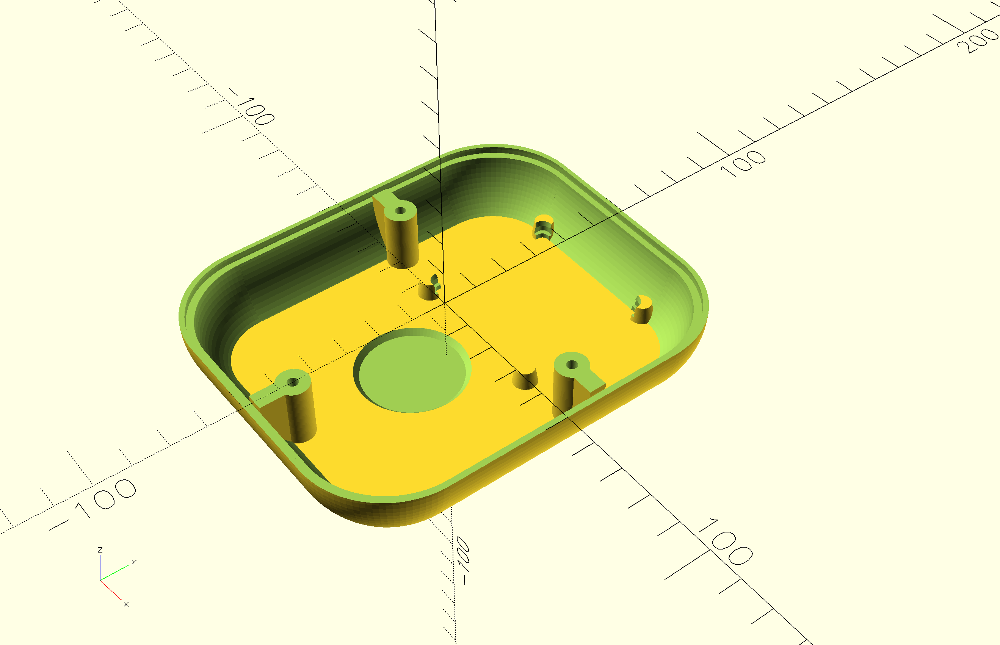

# imperium-ble

Parts:

MCU: XIAO ESP32S3
NFC: PN532 (clone)
Button: Crown / Samducksa SDB-202 30mm Cherry buttons (any 30mm low profile clones should also work)
Joystick: Sanwa JLX-TPML-8YT silent leaf switch joystick (any Sanwa or clone should also work)

Instructions:

Soon...

